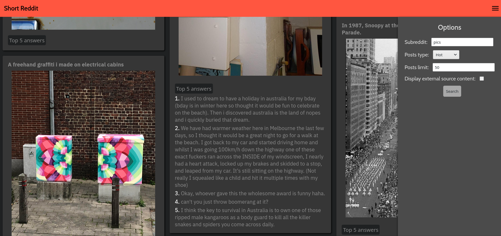

# Short-Reddit &middot;  
Your favorite subreddit shown in the most condensed way.
Checkout live: <a href="https://michalbie.github.io/Short-Reddit/" target="_blank"> https://michalbie.github.io/Short-Reddit/ </a>

## Main features
* Responsiveness
* Reddit posts shown in condensed way
* Showing 5 most popular answers on demand
* Viewing every media (images, videos, gifs)
* Support for showing external sites in iframe (only if this site allows this)
* Sending to actual reddit post after click
* Sorting posts by subreddit, status(Hot, New, Top)
* Setting shown posts limit (up to 900 posts)

## App look

## Technologies used
* HTML
* [LessCSS](http://lesscss.org/ "LessCSS")
* JavaScript
* FetchAPI
* [RedditAPI](https://www.reddit.com/dev/api/ "Reddit API")

## Contribution
Just follow 4-spaces intendation and max 140 characters per line. Everything else should be written like here [Style Guide](https://github.com/bevacqua/js 
"bavacqua style guide"). If you want you can copy my [VSCode Editor Settings](.vscode "VSCode Editor Settings"). I use [Prettier VSCode Extension](https://marketplace.visualstudio.com/items?itemName=esbenp.prettier-vscode) for formatting code.

## To do
1. Redesign sidebar (with form inside)
